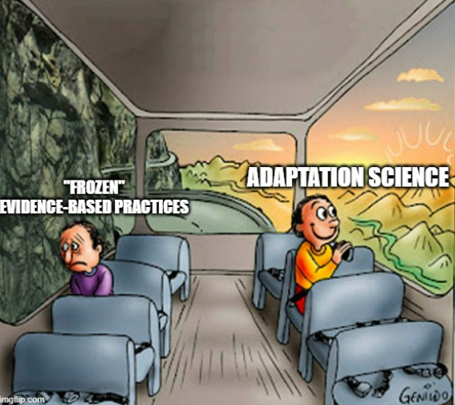
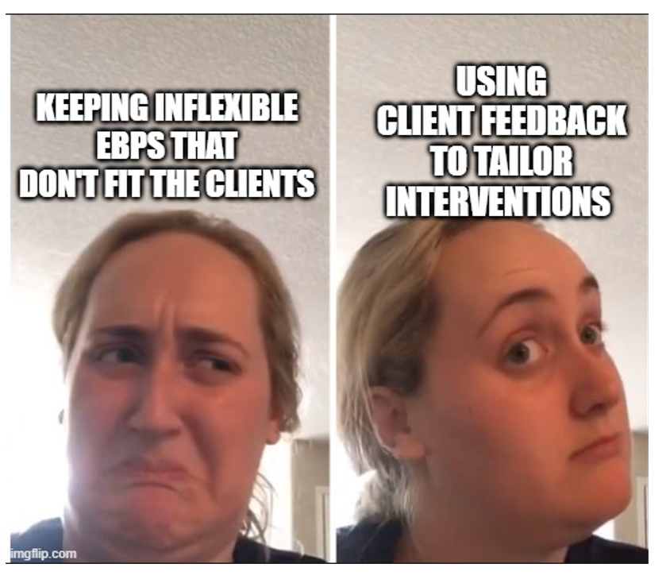

When I started my doctorate in clinical child psychology in 2008, I was ready to learn the answers to solve all the world's mental health problems.

I never understood why my parents, both retired from 30+ years of serving youth and families, would get this glazed- over look in their eyes and start groaning when I would talk to them about "Evidence-based Practices."

Evidence-based Practices were SCIENTIFICALLY proven ways to help kids.  

Why did they seem to hate them?  Didn't they want to help kids with SCIENCE?  

What kind of terrible people were my parents?

Now that I am seven years out from finishing my doctorate, I worry that I get the same look in my eyes when people come to tell me about the latest EBP that is going to change the world.

Working in program evaluation for school mental health, I am perfectly positioned to see the challenges in moving evidence-based practices into real world settings.  When a clinician or educator goes to a training to learn how to do a new treatment or method, I am the person who sends an email 3 months later asking them to take a survey about "how they've used what they learned." 

Often, especially in the past few years, many people coming to trainings haven't been able to use what they learned in quite the way that we had planned for them to. I have had the opportunity to talk to these people about what is getting in the way of them using these EBPs, what has helped them, and how they ended up using their training in a different way.


But where does all this feedback go? I can package it up and send it to our experts, but the EBPs don't change.  
Seeing myself 20 years in the future, helping to roll out the same EBP with the same issues, was depressing.  I was stuck.

```{r images, echo=FALSE}

library (knitr)




```


Fortunately I have an amazing community of people, both colleagues I work with and people I have met on the internet (twitter has been great for this!) that want to keep moving the field forward.

The program evaluation community, including the 2021 American Evaluation Association annual conference, has been a great source of inspiration. Program evaluation really aims to integrate feedback from service providers and the people who are using and (hopefully!) benefiting from services. 

The data science community blew my mind with design thinking.  Talk about external validity!

For awhile I thought I needed to transition out of psychology to apply what I had learned, but having found implementation science....and even adaptation science...I am excited to see what can be done to make mental health supports easier for people (especially people in contexts that differ from "normative" settings) to use and benefit from! 

Plus, creating data systems to take feedback from service providers to the people who make decisions about what practices will be used and how gives me a great excuse to keep improving my data viz and reporting skills.


```{r echo=FALSE}

library (knitr)


```


You can find more thoughts about this in my blog post from AEA 365:


Prout, J. (2021, October). BH TIG Week: Program Evaluation in Behavioral Health: Limitations of Expert-driven Models and New Directions. AEA 365: A Tip-a-Day By and For Evaluators. 
https://shar.es/aWds4j


